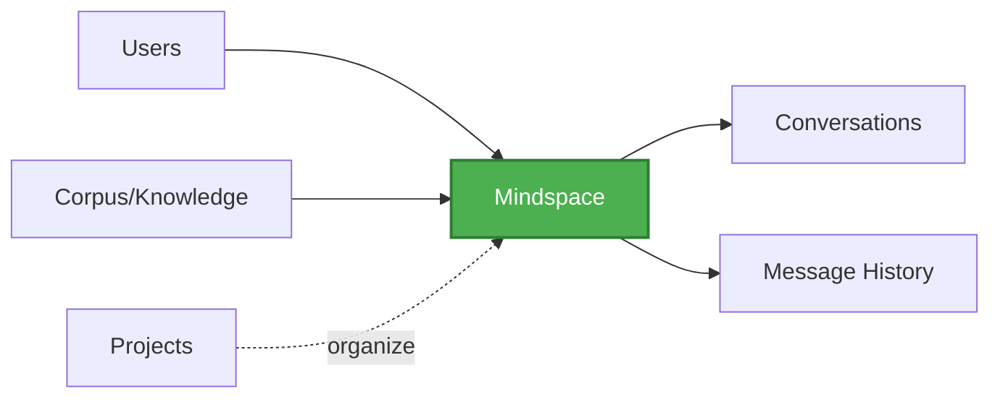

# Magick Mind SDK

Python SDK for seamless integration with the Magick Mind platform (Bifrost). This SDK provides type-safe, validated access to Bifrost's chat, mindspace, and realtime features.

> [!IMPORTANT]
> **Backend-Only SDK**  
> This SDK is designed for **server-side applications only** and requires service-level authentication. It cannot be used directly by end users in browsers or mobile apps.
> 
> **Architecture:** End Users → Your Backend (+ SDK) → Bifrost  
> See [Backend Architecture Guide](docs/architecture/backend_architecture.md) for details.

## Features

- 🔐 **Authentication**: Secure login with email/password
- 💬 **Chat**: Type-safe chat resource with Pydantic validation
- 🧠 **Mindspaces**: Manage AI reasoning contexts and conversations  
- 📡 **Realtime**: WebSocket client for live AI responses with deduplication
- 🔑 **Typed Resources**: Mindspaces, Projects, Corpus, API Keys, Artifacts, End Users, History
- ✅ **Validation**: Automatic request/response validation with Pydantic
- 🎯 **Developer Experience**: Clean, intuitive API design
- Desktop applications (PyQt, Tkinter, wxPython)
- CLI tools and automation scripts
- Server-side scripts
- **Robotics/IoT (Self-Service)**: Single device authenticates and subscribes to its own channel

**For web/mobile frontends:** If you're building browser-based apps or native mobile apps, you would need JavaScript, Swift, or Kotlin SDKs (not yet available). This Python SDK is for your backend.

**Common architecture:**
```
[Your Frontend/App] ←→ [Your Backend + This SDK] ←→ [Bifrost SaaS]
```

**Robotics/IoT (Self-Service):**
```
[Robot/Device with SDK] ←→ [Bifrost SaaS]
```
In this pattern, the device authenticates as itself and subscribes to its own channel. See [Event-Driven Patterns](docs/architecture/event_driven_patterns.md#self-service-pattern-roboticsiot) for details.


## Installation

Using `uv` (recommended):

```bash
cd AGD_Magick_Mind_SDK
uv sync
```

Using pip:

```bash
cd AGD_Magick_Mind_SDK
pip install -e .
```

## Core Concepts

### Mindspaces: The Central Hub

**Mindspace is the central organizing concept in Bifrost** - it's where conversations, knowledge, and collaboration converge. When designing your application architecture, start by thinking about mindspaces:

- **All chat conversations happen within a mindspace**
- **Knowledge (corpus) attaches to mindspaces** to provide context for AI responses  
- **Users collaborate through mindspaces** (private for individuals, group for teams)
- **Everything connects through mindspaces** - projects, messages, artifacts



**Architectural Implication**: When building with Bifrost, most operations reference a `mindspace_id`. This is by design - mindspaces provide the context and scope for AI interactions.

📖 **Learn more:** [Mindspace Resource Guide](docs/resources/mindspace.md)

## Quick Start

### Authentication

The SDK uses **email/password authentication** which calls bifrost's `/v1/auth/login` endpoint:

```python
from magick_mind import MagickMind

# Create client with email/password
client = MagickMind(
    email="user@example.com",
    password="your_password",
    base_url="https://bifrost.example.com"
)

# Authentication happens automatically on first API call
# Tokens are automatically refreshed when needed
print(f"Authenticated: {client.is_authenticated()}")
```

> **Note**: The `api_key` you might see in chat requests is **not for SDK authentication**. 
> It's a parameter you pass when calling LLM endpoints (for tracking/billing). 
> The SDK itself authenticates with JWT tokens from `/v1/auth/login`.

### Making API Calls

```python
# Once authenticated, use the HTTP client to make requests
# The client automatically adds authentication headers

# POST request
response = client.http.post(
    "/v1/magickmind/chat",
    json={
        "api_key": "sk-your-llm-key",
        "message": "Hello!",
        "chat_id": "chat-123",
        "sender_id": "user-456"
    }
)

# GET request
response = client.http.get("/v1/some-endpoint")
```

### Context Manager

```python
# Use as context manager for automatic cleanup
with MagickMind(email="user@example.com", password="pass", base_url="...") as client:
    response = client.http.get("/v1/endpoint")
    # Client automatically closes when exiting context
```

## HTTP Client for Power Users

The `client.http` property provides direct access to the authenticated HTTP client. This is intended for:

**Bifrost Developers:**
- Testing new endpoints before implementing resources
- Experimenting with beta/experimental features
- Quick prototyping

**Power Users:**
- Direct API access without waiting for typed resources
- One-off calls or custom integrations

```python
# Test experimental endpoint
response = client.http.post(
    "/beta/new-feature",
    json={"test": "data"}
)

# Mix versions in same app
v1_response = client.http.post("/v1/magickmind/chat", json={...})
beta_response = client.http.post("/beta/magickmind/chat", json={...})
```

The HTTP client automatically handles:
- ✅ Authentication token injection
- ✅ Token refresh when expired
- ✅ Error mapping to SDK exceptions
- ✅ Same configuration as main client

## Authentication

The SDK uses **email/password authentication** with JWT tokens:

Uses bifrost's `/v1/auth/login` endpoint. Automatically handles:
- Initial login
- Token caching
- Automatic token refresh using refresh_token
- Re-authentication when refresh token expires

```python
client = MagickMind(
    email="your@email.com",
    password="your_password",
    base_url="https://bifrost.example.com"
)
```

### About API Keys

If you see `api_key` in documentation or code examples, note that this is **NOT for authenticating the SDK**. 
The `api_key` is a parameter you pass when calling specific endpoints (like chat) for LLM access:

```python
# SDK authenticates with email/password (JWT)
client = MagickMind(email="...", password="...", base_url="...")

# api_key is passed as a parameter to LLM endpoints
# response = client.chat(api_key="your-llm-api-key", message="Hello")
```


## Examples

See the `examples/` directory for complete working examples:

- `examples/email_password_auth.py` - Email/password with auto-refresh
- `examples/backend_service.py` - Production-ready backend service pattern
- `examples/chat_example.py` - Using the typed chat resource

Run example:

```bash
# Set environment variables
export BIFROST_BASE_URL="http://localhost:8888"
export BIFROST_EMAIL="user@example.com"
export BIFROST_PASSWORD="your_password"

# Run example
uv run python examples/email_password_auth.py
```

## Backend Integration

If you're building a **backend service** that uses this SDK as middleware (e.g., your backend receives data from Bifrost and manages state for your own frontend), see:

📖 **[Backend Integration Guide](docs/guides/backend_integration.md)**

Covers production patterns for:
- Message deduplication
- Hybrid realtime + HTTP sync
- Recovery from disconnects
- Reliable message processing

Example backend service:
```python
from magick_mind import MagickMind
from examples.backend_service import ChatBackendService

client = MagickMind(email="...", password="...", base_url="...")
service = ChatBackendService(client)

# Handles realtime events + periodic sync for reliability
await service.start(mindspace_id="mind-123", user_id="service-user")
```

## Event-Driven Architecture

The SDK supports event-driven patterns with both realtime WebSocket events and HTTP APIs.

📖 **[Event-Driven Patterns Guide](docs/architecture/event_driven_patterns.md)**

Learn about:
- Events as source of truth (current Bifrost)
- Events as notifications (industry standard)
- Hybrid approaches for production
- Migration paths

## Realtime WebSocket Client

The SDK provides a powerful realtime client for receiving live updates via WebSocket. This is essential for building reactive applications that need instant notifications.

### Quick Example

```python
import asyncio
from magick_mind import MagickMind
from magick_mind.realtime.handler import RealtimeEventHandler

class MyHandler(RealtimeEventHandler):
    async def on_message(self, user_id: str, payload):
        # Automatically receives parsed messages
        print(f"Update for {user_id}: {payload}")

async def main():
    client = MagickMind(
        email="user@example.com",
        password="password", 
        base_url="https://bifrost.example.com",
        ws_endpoint="wss://bifrost.example.com/connection/websocket"
    )
    
    # Connect with handler
    await client.realtime.connect(events=MyHandler())
    
    # Subscribe to users (creates per-user channels)
    await client.realtime.subscribe_many(["user-1", "user-2", "user-3"])
    
    # Keep listening...
    await asyncio.sleep(60)

asyncio.run(main())
```

### Key Features

- **Per-User Subscriptions** - Each user gets their own secure channel
- **Bulk Operations** - `subscribe_many()` for handling 100s of users efficiently  
- **Auto-Reconnect** - Centrifugo handles connection recovery automatically
- **Type-Safe Handlers** - `RealtimeEventHandler` provides clean callback interface

### Architecture: Per-User Pattern

When building relay services or multi-user applications, the SDK uses a **per-user subscription model**:

- **500 users = 500 subscriptions** (not 1 room channel)
- Each user has an isolated subscription
- Ensures privacy, security, and efficient server-side filtering
- Single WebSocket connection multiplexes all subscriptions

**Why 500 subscriptions is correct:**
- 🔒 Security: Users can't see each other's data
- 📊 Efficiency: Server only sends relevant messages
- 📈 Scalable: Centrifugo handles millions of channels

📖 **[Complete Realtime Guide](docs/realtime_guide.md)** - Covers subscription patterns, bulk operations, error handling, and relay service architecture.

## Extending the SDK

The SDK currently provides authentication and HTTP client foundation. Want to add typed resource clients (e.g., `client.chat.send(...)`)?

See **[docs/contributing/resource_implementation_guide/](docs/contributing/resource_implementation_guide/)** for a complete reference implementation showing:

- ✅ Pydantic models for request/response validation
- ✅ Version-aware resource classes (v1, v2)  
- ✅ Clean namespace pattern (`client.v1.chat`, `client.v2.chat`)
- ✅ Working usage examples

This serves as a template for adding chat, history, users, or any other resources to the SDK.

## Future Plans

### Versioned Resources

When resources are implemented, they will follow a namespace pattern:

```python
client = MagickMind(...)

# Explicit version access
client.v1.chat.send(...)       # Always v1 (stable)
client.v2.chat.send(...)       # Always v2 (new features)
client.beta.chat.send(...)     # Beta/experimental

# Mix and match versions
client.v1.history.list(...)    # Use stable for some endpoints
client.beta.chat.send(...)     # Test beta for others
```

**Key principles:**
- **Explicit over implicit** - Users choose exact version
- **Type safe** - Each version has different request/response types
- **Mix-and-match** - Can use different versions for different endpoints
- **Sparse coverage** - Only implement resources that exist in bifrost
  - Example: If `/beta/chat` exists but `/beta/history` doesn't, `client.beta` only has `chat`

**Why this approach:**
- Safe gradual migration (v1 → v2)
- Test breaking changes before full adoption
- Clear which version you're using
- No surprises when SDK updates

### Example Usage Scenarios

**Scenario 1: Production app using stable v1**
```python
client = MagickMind(...)

# All endpoints use v1
response = client.v1.chat.send(...)
history = client.v1.history.list(...)
user = client.v1.users.get(...)
```

**Scenario 2: Testing beta chat, keeping others stable**
```python
client = MagickMind(...)

# Test new chat features
response = client.beta.chat.send(
    message="...",
    temperature=0.8,  # New parameter in beta
    context={...}      # New context support
)

# Keep other endpoints stable
history = client.v1.history.list(...)
user = client.v1.users.get(...)
```

**Scenario 3: Gradual migration v1 → v2**
```python
# Week 1: Start migrating chat to v2
response = client.v2.chat.send(...)  # Migrated
history = client.v1.history.list(...)  # Still v1

# Week 2: Migrate more endpoints
history = client.v2.history.list(...)  # Migrated
user = client.v1.users.get(...)  # Still v1

# Week 3: Fully migrated
# All endpoints now use v2
```

**Scenario 4: Bifrost dev testing experimental endpoint**
```python
client = MagickMind(...)

# Test endpoint that doesn't have resource yet
response = client.http.post(
    "/experimental/ai-agents",
    json={"task": "analyze data"}
)

# Use typed resources for stable endpoints
chat = client.v1.chat.send(...)
```

### Default Shortcuts (Future)

For convenience, SDK may add `client.chat` shortcuts that point to a default version:

**SDK 1.x series:**
```python
client = MagickMind(...)

# Shortcuts point to v1 (stable)
client.chat.send(...)      # → client.v1.chat.send(...)
client.history.list(...)   # → client.v1.history.list(...)

# Explicit always available
client.v1.chat.send(...)   # Explicit v1
client.v2.chat.send(...)   # Explicit v2 (when available)
```

**SDK 2.x series (breaking change):**
```python
client = MagickMind(...)

# Shortcuts now point to v2 (BREAKING!)
client.chat.send(...)      # → client.v2.chat.send(...)

# Explicit v1 still works
client.v1.chat.send(...)   # Pin to v1 for stability
```

**Best practice:** Use explicit versions (`client.v1.chat`) for production code that needs stability.

### Deprecation and Migration

When bifrost deprecates an API version, SDK will follow this pattern:

**Phase 1: Deprecation Warning**
```python
# SDK 1.5: v1 still works but warns
response = client.v1.chat.send(...)
# Warning: v1 chat API is deprecated, migrate to v2 by 2025-06-01
```

**Phase 2: Both Versions Co-exist**
```python
# SDK 1.x: Both v1 and v2 available
client.v1.chat.send(...)  # Deprecated but works
client.v2.chat.send(...)  # Recommended
```

**Phase 3: Removal in Next Major Version**
```python
# SDK 2.0: v1 removed
client.v1.chat.send(...)  # ❌ AttributeError
client.v2.chat.send(...)  # ✅ Works
```

**Migration guide provided in CHANGELOG for each breaking change.**

## Error Handling

The SDK provides specific exceptions for different error scenarios:

```python
from magick_mind import (
    MagickMind,
    AuthenticationError,
    TokenExpiredError,
    ProblemDetailsException,
    ValidationError,
    RateLimitError
)

try:
    client = MagickMind(email="user@example.com", password="wrong", base_url="...")
    response = client.http.get("/v1/endpoint")
except AuthenticationError as e:
    print(f"Authentication failed: {e}")
except TokenExpiredError as e:
    print(f"Token expired: {e}")
except RateLimitError as e:
    print(f"Rate limited: {e}")
except ValidationError as e:
    # Handle field-level validation errors (400 Bad Request)
    print(f"Validation error: {e.detail}")
    for field, errors in e.get_field_errors().items():
        print(f"  {field}: {', '.join(errors)}")
except ProblemDetailsException as e:
    # Handle other API errors (RFC 7807 Problem Details)
    print(f"API error: {e.title} - {e.detail}")
    print(f"Request ID: {e.request_id}")  # For support tickets
```

## Configuration

Customize SDK behavior:

```python
client = MagickMind(
    email="user@example.com",
    password="password",
    base_url="https://bifrost.example.com",
    timeout=60.0,        # Request timeout in seconds (default: 30.0)
    verify_ssl=True      # Verify SSL certificates (default: True)
)
```

## Development

### Install development dependencies

```bash
uv sync --all-extras
```

### Run tests

```bash
uv run pytest tests/ -v
```

## License

MIT License - see LICENSE file for details.

## Authors

- Adrian (minoak@globalmagicko.com)
- Turtle (turtle@globalmagicko.com)
- Min Thu Wai (minthu@globalmagicko.com)
