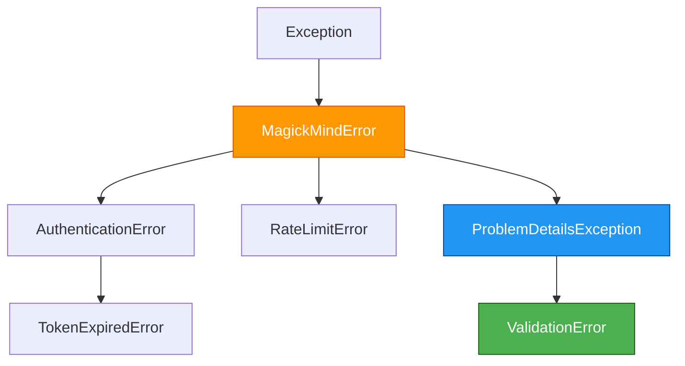

# Error Handling Guide

This guide covers error handling patterns in the Magick Mind SDK, including all exception types, common scenarios, and best practices for production applications.

## Exception Hierarchy



## Exception Types

### MagickMindError

**Base exception for all SDK errors.**

```python
class MagickMindError(Exception):
    """Base exception for all Magick Mind SDK errors."""
    message: str
    status_code: int | None
```

**When It's Raised:**
- Base class for all SDK exceptions
- Rarely raised directly (typically subclasses are raised)
- Used as catch-all when you want to handle any SDK error

**Available Attributes:**
- `message` - Error message
- `status_code` - HTTP status code (if applicable)

**Example:**
```python
try:
    client.v1.chat.send(...)
except MagickMindError as e:
    # Catches any SDK error
    logger.error(f"SDK error: {e.message}")
    if e.status_code:
        logger.error(f"HTTP status: {e.status_code}")
```

---

### AuthenticationError

**Raised when authentication fails.**

```python
class AuthenticationError(MagickMindError):
    """Raised when authentication fails."""
```

**When It's Raised:**
- Invalid email or password during `MagickMind()` initialization
- JWT token is invalid or malformed
- Authentication endpoint is unreachable

**Common Causes:**
- Wrong credentials
- Account doesn't exist
- Bifrost service is down
- Network connectivity issues

**Recovery:**
```python
from magick_mind import MagickMind, AuthenticationError

try:
    client = MagickMind(
        email="user@example.com",
        password="password",
        base_url="https://bifrost.example.com"
    )
except AuthenticationError as e:
    logger.error(f"Authentication failed: {e.message}")
    # Re-authenticate with correct credentials
    # Or prompt user for credentials
```

---

### TokenExpiredError

**Raised when a JWT token has expired.**

```python
class TokenExpiredError(AuthenticationError):
    """Raised when a token has expired."""
```

**When It's Raised:**
- Access token has expired
- Refresh token has expired (requires re-authentication)

**Recovery:**
> [!NOTE]
> The SDK **automatically handles token refresh** using the refresh token. You typically don't need to catch this exception unless you want to log refresh events.

```python
from magick_mind import TokenExpiredError

try:
    response = client.v1.chat.send(...)
except TokenExpiredError as e:
    # SDK should have already attempted refresh
    logger.warning(f"Token expired: {e.message}")
    # If this fails, both access and refresh tokens are invalid
    # Re-authenticate from scratch
```

---

### ProblemDetailsException

**RFC 7807 Problem Details error from Bifrost API.**

This is the **most common exception** you'll encounter when using the SDK. It represents any HTTP error response (4xx, 5xx) from the Bifrost API formatted according to RFC 7807.

```python
class ProblemDetailsException(MagickMindError):
    """RFC 7807 Problem Details error from Bifrost."""
    type_uri: str
    title: str
    status: int
    detail: str
    instance: str | None
    request_id: str | None
    validation_errors: list[FieldError]
    problem: ProblemDetails  # Full Pydantic model
    response_data: dict | None
```

**When It's Raised:**
- 400 Bad Request (without field errors)
- 403 Forbidden
- 404 Not Found
- 500 Internal Server Error
- Any API error following RFC 7807 format

**Key Attributes:**

| Attribute | Type | Description |
|-----------|------|-------------|
| `status` | `int` | HTTP status code (400, 404, 500, etc.) |
| `title` | `str` | Short error summary |
| `detail` | `str` | Detailed error explanation |
| `request_id` | `str \| None` | **Request ID for support tickets** |
| `type_uri` | `str` | Error type URI (RFC 7807) |
| `instance` | `str \| None` | Specific instance of this error |
| `validation_errors` | `list` | Field errors (usually empty, see ValidationError) |

**Example:**
```python
from magick_mind.exceptions import ProblemDetailsException

try:
    response = client.v1.chat.send(
        api_key="sk-test",
        mindspace_id="nonexistent-id",
        message="Hello",
        enduser_id="user-123"
    )
except ProblemDetailsException as e:
    logger.error(f"API Error: [{e.status}] {e.title}")
    logger.error(f"Detail: {e.detail}")
    
    # IMPORTANT: Save request_id for support tickets!
    if e.request_id:
        logger.error(f"Request ID: {e.request_id}")
        # Send to error monitoring system
```

**Common Status Codes:**

| Status | Meaning | Typical Cause |
|--------|---------|---------------|
| 400 | Bad Request | Invalid parameters (see ValidationError) |
| 403 | Forbidden | Insufficient permissions |
| 404 | Not Found | Resource doesn't exist |
| 409 | Conflict | Resource already exists |
| 500 | Internal Server Error | Bifrost server error |
| 502 | Bad Gateway | Upstream service error |
| 503 | Service Unavailable | Bifrost temporarily down |

---

### ValidationError

**400 Bad Request with field-level validation errors.**

Subclass of `ProblemDetailsException` specifically for validation failures.

```python
class ValidationError(ProblemDetailsException):
    """400 Bad Request with field-level validation errors."""
    
    def get_field_errors(self) -> dict[str, list[str]]:
        """Get errors grouped by field name for UI display."""
```

**When It's Raised:**
- Missing required fields
- Invalid field format (e.g., invalid email)
- Field value out of range
- Type mismatch

**Key Methods:**
- `get_field_errors()` - Returns `dict[field_name, list[error_messages]]`

**Example:**
```python
from magick_mind.exceptions import ValidationError

try:
    response = client.v1.chat.send(
        api_key="",  # Invalid: empty
        mindspace_id="",  # Invalid: empty
        message="",  # Invalid: empty
        enduser_id="user-123"
    )
except ValidationError as e:
    logger.error(f"Validation failed: {e.title}")
    logger.error(f"Request ID: {e.request_id}")
    
    # Extract field-level errors for UI display
    for field, messages in e.get_field_errors().items():
        logger.error(f"  {field}:")
        for msg in messages:
            logger.error(f"    - {msg}")
    
    # Example output:
    # api_key:
    #   - Field required
    # mindspace_id:
    #   - Field required
    # message:
    #   - String should have at least 1 character
```

**UI Integration Example:**
```python
def display_validation_errors(error: ValidationError):
    """Display field errors in a user-friendly format."""
    field_errors = error.get_field_errors()
    
    return {
        "status": "error",
        "message": error.title,
        "fields": field_errors,
        "request_id": error.request_id
    }

# Returns:
# {
#   "status": "error",
#   "message": "Validation Error",
#   "fields": {
#     "message": ["String should have at least 1 character"],
#     "api_key": ["Field required"]
#   },
#   "request_id": "req-abc123"
# }
```

---

### RateLimitError

**Raised when API rate limit is exceeded (429 Too Many Requests).**

```python
class RateLimitError(MagickMindError):
    """Raised when rate limit is exceeded."""
```

**When It's Raised:**
- Too many requests in a short time period
- Per-user rate limit exceeded
- Per-API-key rate limit exceeded

**Recovery Strategy:**
Implement **exponential backoff** retry logic.

**Example:**
```python
import time
from magick_mind.exceptions import RateLimitError

def exponential_backoff(attempt: int, base_delay: float = 1.0) -> float:
    """Calculate backoff delay with max cap."""
    return min(base_delay * (2 ** attempt), 60.0)  # Max 60 seconds

def send_with_retry(client, mindspace_id, message, max_retries=3):
    """Send message with retry logic."""
    for attempt in range(max_retries):
        try:
            return client.v1.chat.send(
                api_key="sk-test",
                mindspace_id=mindspace_id,
                message=message,
                enduser_id="user-123"
            )
        except RateLimitError as e:
            if attempt == max_retries - 1:
                logger.error("Max retries reached")
                raise
            
            delay = exponential_backoff(attempt)
            logger.warning(f"Rate limited, retrying in {delay}s...")
            time.sleep(delay)
```

---

## Error Catalog

Comprehensive mapping of HTTP status codes to SDK exceptions and recommended actions.

| HTTP Status | Exception | When It Occurs | Recommended Action |
|-------------|-----------|----------------|-------------------|
| **400** | `ValidationError` | Invalid request data with field errors | Fix request parameters using `get_field_errors()` |
| **400** | `ProblemDetailsException` | Invalid request without field errors | Check `detail` for specific issue |
| **401** | `AuthenticationError` | Invalid credentials or token | Re-authenticate with valid credentials |
| **403** | `ProblemDetailsException` | Forbidden resource access | Check user permissions and resource ownership |
| **404** | `ProblemDetailsException` | Resource not found | Verify IDs are correct and resource exists |
| **409** | `ProblemDetailsException` | Resource conflict (e.g., already exists) | Use different identifier or update existing |
| **429** | `RateLimitError` | Rate limit exceeded | Implement exponential backoff retry |
| **500** | `ProblemDetailsException` | Bifrost server error | Retry with backoff, contact support if persists |
| **502** | `ProblemDetailsException` | Bad gateway (upstream error) | Retry with backoff |
| **503** | `ProblemDetailsException` | Service temporarily unavailable | Retry with backoff |

---

## Common Scenarios

### Scenario 1: Field Validation Failed

**Problem:** You sent invalid data and need to show specific field errors to the user.

**Solution:**
```python
from magick_mind.exceptions import ValidationError

try:
    response = client.v1.end_user.create(
        name="",  # Invalid: empty
        external_id="user@example.com"
    )
except ValidationError as e:
    # Log for debugging
    logger.error(f"Validation failed: {e.title}")
    logger.error(f"Request ID: {e.request_id}")
    
    # Extract field errors for UI
    errors = e.get_field_errors()
    
    # Display to user
    for field, messages in errors.items():
        print(f"❌ {field}: {', '.join(messages)}")
    
    # Output:
    # ❌ name: String should have at least 1 character
```

---

### Scenario 2: Rate Limiting

**Problem:** You're making too many requests and getting rate limited.

**Solution:** Implement retry with exponential backoff.

```python
import asyncio
from magick_mind.exceptions import RateLimitError

async def send_with_retry(client, message, max_retries=5):
    """Send with exponential backoff on rate limit."""
    base_delay = 1.0
    
    for attempt in range(max_retries):
        try:
            response = await asyncio.to_thread(
                client.v1.chat.send,
                api_key="sk-test",
                mindspace_id="mind-123",
                message=message,
                enduser_id="user-456"
            )
            return response
            
        except RateLimitError as e:
            if attempt == max_retries - 1:
                logger.error("Max retries reached for rate limit")
                raise
            
            # Exponential backoff: 1s, 2s, 4s, 8s, 16s
            delay = min(base_delay * (2 ** attempt), 60.0)
            logger.warning(
                f"Rate limited (attempt {attempt + 1}/{max_retries}), "
                f"retrying in {delay:.1f}s..."
            )
            await asyncio.sleep(delay)

# Usage
response = await send_with_retry(client, "Hello!")
```

---

### Scenario 3: Token Expired During Long-Running Operation

**Problem:** Your access token expires during a long operation.

**Solution:** The SDK handles this automatically, but you can log it.

```python
from magick_mind.exceptions import TokenExpiredError

try:
    # Long-running operation
    for i in range(1000):
        response = client.v1.chat.send(...)
        
except TokenExpiredError as e:
    # SDK already tried to refresh
    logger.error(f"Token refresh failed: {e}")
    logger.error("Both access and refresh tokens expired - re-authenticate")
    
    # Re-authenticate from scratch
    client = MagickMind(email="...", password="...")
```

---

### Scenario 4: Resource Not Found

**Problem:** You're trying to access a resource that doesn't exist.

**Solution:** Check the status code and handle appropriately.

```python
from magick_mind.exceptions import ProblemDetailsException

try:
    mindspace = client.v1.mindspace.get(mindspace_id="nonexistent")
except ProblemDetailsException as e:
    if e.status == 404:
        logger.error(f"Mindspace not found: {e.detail}")
        # Create the mindspace or use a different ID
    else:
        logger.error(f"Unexpected error [{e.status}]: {e.detail}")
        logger.error(f"Request ID: {e.request_id}")
```

---

### Scenario 5: Server Error (500)

**Problem:** Bifrost is experiencing an internal error.

**Solution:** Retry with backoff and log request_id for support.

```python
from magick_mind.exceptions import ProblemDetailsException
import time

def is_retryable(status: int) -> bool:
    """Check if error status is retryable."""
    return status >= 500 or status == 429

def send_with_server_retry(client, message, max_retries=3):
    """Retry on server errors."""
    for attempt in range(max_retries):
        try:
            return client.v1.chat.send(
                api_key="sk-test",
                mindspace_id="mind-123",
                message=message,
                enduser_id="user-456"
            )
        except ProblemDetailsException as e:
            # Don't retry client errors (4xx except 429)
            if not is_retryable(e.status):
                logger.error(f"Client error [{e.status}]: {e.detail}")
                logger.error(f"Request ID: {e.request_id}")
                raise
            
            # Retry server errors
            if attempt == max_retries - 1:
                logger.error(f"Max retries reached for server error")
                logger.error(f"Request ID: {e.request_id} ← Contact support")
                raise
            
            delay = 2 ** attempt  # 1s, 2s, 4s
            logger.warning(
                f"Server error {e.status} (attempt {attempt + 1}/{max_retries}), "
                f"retrying in {delay}s..."
            )
            time.sleep(delay)
```

---

## Best Practices

### 1. Always Catch Specific Exceptions First

Order exception handlers from **most specific to least specific**:

```python
# ✅ Good: Specific first
try:
    response = client.v1.chat.send(...)
except ValidationError as e:
    # Handle field errors
    handle_validation_errors(e)
except RateLimitError as e:
    # Handle rate limiting
    retry_with_backoff(e)
except ProblemDetailsException as e:
    # Handle other API errors
    log_api_error(e)
except MagickMindError as e:
    # Catch any other SDK error
    log_sdk_error(e)

# ❌ Bad: Generic first (masks specific errors)
try:
    response = client.v1.chat.send(...)
except MagickMindError as e:  # Too broad!
    logger.error(f"Error: {e}")
```

---

### 2. Always Log request_id for Support

The `request_id` is **critical for debugging** with Bifrost support:

```python
except ProblemDetailsException as e:
    logger.error(
        f"API error: [{e.status}] {e.title}",
        extra={
            "request_id": e.request_id,  # ← Include in logs!
            "status": e.status,
            "detail": e.detail,
        }
    )
```

---

### 3. Implement Retry Logic for Transient Errors

Use exponential backoff for:
- ✅ 429 (Rate Limit)
- ✅ 500+ (Server Errors)
- ❌ Don't retry 400-403 (Client Errors)

```python
def is_retryable(exception):
    """Check if error should be retried."""
    if isinstance(exception, RateLimitError):
        return True
    if isinstance(exception, ProblemDetailsException):
        return exception.status >= 500
    return False
```

---

### 4. Handle ValidationError Fields for UI

Extract field errors for user-friendly display:

```python
def format_validation_errors(error: ValidationError) -> dict:
    """Format validation errors for JSON API response."""
    return {
        "error": "validation_failed",
        "message": error.title,
        "fields": error.get_field_errors(),
        "request_id": error.request_id
    }

# Returns:
# {
#   "error": "validation_failed",
#   "message": "Validation Error",
#   "fields": {
#     "email": ["Invalid email format"],
#     "name": ["String should have at least 1 character"]
#   },
#   "request_id": "req-abc123"
# }
```

---

### 5. Use Structured Logging

Include error context in structured logs:

```python
import logging
from magick_mind.exceptions import ProblemDetailsException

logger = logging.getLogger(__name__)

try:
    response = client.v1.chat.send(...)
except ProblemDetailsException as e:
    logger.error(
        "Chat API error",
        extra={
            "error_type": e.__class__.__name__,
            "status": e.status,
            "title": e.title,
            "detail": e.detail,
            "request_id": e.request_id,
            "type_uri": e.type_uri,
        },
        exc_info=True  # Include traceback
    )
```

---

## Integration Examples

### With Error Monitoring (Sentry)

```python
import sentry_sdk
from magick_mind.exceptions import ProblemDetailsException

sentry_sdk.init(dsn="...")

try:
    response = client.v1.chat.send(...)
except ProblemDetailsException as e:
    # Add context to Sentry
    with sentry_sdk.push_scope() as scope:
        scope.set_context("error_details", {
            "status": e.status,
            "title": e.title,
            "detail": e.detail,
            "request_id": e.request_id,
            "type_uri": e.type_uri,
        })
        scope.set_tag("request_id", e.request_id)
        sentry_sdk.capture_exception(e)
    raise
```

---

### With Retry Library (tenacity)

```python
from tenacity import (
    retry,
    stop_after_attempt,
    wait_exponential,
    retry_if_exception,
)
from magick_mind.exceptions import RateLimitError, ProblemDetailsException

def should_retry(exception):
    """Determine if we should retry this exception."""
    if isinstance(exception, RateLimitError):
        return True
    if isinstance(exception, ProblemDetailsException):
        return exception.status >= 500
    return False

@retry(
    retry=retry_if_exception(should_retry),
    stop=stop_after_attempt(5),
    wait=wait_exponential(multiplier=1, min=1, max=60)
)
def send_message(client, message):
    """Send message with automatic retry."""
    return client.v1.chat.send(
        api_key="sk-test",
        mindspace_id="mind-123",
        message=message,
        enduser_id="user-456"
    )

# Usage
response = send_message(client, "Hello!")
```

---

### In Production Backend Service

```python
import logging
from magick_mind import MagickMind
from magick_mind.exceptions import (
    ValidationError,
    RateLimitError,
    ProblemDetailsException,
)

logger = logging.getLogger(__name__)

class ChatService:
    def __init__(self, client: MagickMind):
        self.client = client
    
    def send_message(self, mindspace_id: str, message: str, user_id: str):
        """Send chat message with production-ready error handling."""
        try:
            response = self.client.v1.chat.send(
                api_key=self._get_api_key(),
                mindspace_id=mindspace_id,
                message=message,
                enduser_id=user_id
            )
            
            logger.info(
                "Message sent successfully",
                extra={"message_id": response.content.message_id}
            )
            return response
            
        except ValidationError as e:
            # Log validation errors and return user-friendly response
            logger.warning(
                "Validation failed",
                extra={
                    "request_id": e.request_id,
                    "fields": e.get_field_errors()
                }
            )
            raise ValueError(f"Invalid input: {e.get_field_errors()}")
            
        except RateLimitError as e:
            # Log rate limit and trigger backoff
            logger.error(
                "Rate limit exceeded",
                extra={"status": e.status_code}
            )
            # Trigger circuit breaker or backoff mechanism
            self._trigger_backoff()
            raise
            
        except ProblemDetailsException as e:
            # Log API errors with full context
            logger.error(
                f"Bifrost API error: [{e.status}] {e.title}",
                extra={
                    "request_id": e.request_id,
                    "status": e.status,
                    "detail": e.detail,
                    "type_uri": e.type_uri,
                },
                exc_info=True
            )
            
            # Decide whether to retry based on status
            if e.status >= 500:
                # Server error - retry later
                self._schedule_retry(mindspace_id, message, user_id)
            
            raise
    
    def _get_api_key(self) -> str:
        """Get LLM API key from environment."""
        return os.getenv("OPENROUTER_API_KEY", "sk-test")
    
    def _trigger_backoff(self):
        """Trigger rate limit backoff mechanism."""
        # Implement circuit breaker pattern
        pass
    
    def _schedule_retry(self, mindspace_id, message, user_id):
        """Schedule message for retry (e.g., via task queue)."""
        # Add to retry queue (Celery, RQ, etc.)
        pass
```

---

## Troubleshooting

### "I keep getting ValidationError but don't know which field is wrong"

**Solution:** Use `get_field_errors()` to see field-specific errors:

```python
except ValidationError as e:
    print(f"Validation failed: {e.title}")
    for field, messages in e.get_field_errors().items():
        print(f"  - {field}: {', '.join(messages)}")
```

---

### "My token keeps expiring during long operations"

**Solution:** The SDK auto-refreshes tokens. If this fails, both access and refresh tokens are expired:

```python
# The SDK handles refresh automatically
# If you still get TokenExpiredError, re-authenticate:
client = MagickMind(email="...", password="...")
```

---

### "I'm getting rate limited too often"

**Solutions:**
1. Implement request batching
2. Add exponential backoff retry
3. Reduce request frequency
4. Contact support for rate limit increase

```python
# Batch requests
messages = ["Hello", "Hi", "Hey"]
for msg in messages:
    try:
        send_with_retry(client, msg, max_retries=5)
    except RateLimitError:
        logger.error("Persistent rate limit - reduce frequency")
        break
```

---

### "How do I report a bug to Bifrost support?"

**Always include:**
1. ✅ `request_id` from the exception
2. ✅ HTTP status code
3. ✅ Error title and detail
4. ✅ What you were trying to do
5. ✅ SDK version

```python
except ProblemDetailsException as e:
    # Save this for support:
    logger.error(f"""
    Error Report:
    - Request ID: {e.request_id}
    - Status: {e.status}
    - Title: {e.title}
    - Detail: {e.detail}
    - Type: {e.type_uri}
    - SDK Version: {magick_mind.__version__}
    """)
```

---

## Summary

**Key Takeaways:**

✅ **Catch specific exceptions first** (ValidationError → ProblemDetailsException → MagickMindError)  
✅ **Always log `request_id`** for support tickets  
✅ **Implement retry with exponential backoff** for 429 and 5xx errors  
✅ **Use `get_field_errors()`** to display validation errors in UI  
✅ **Don't retry 4xx errors** (except 429)  
✅ **Use structured logging** with error context

**For more examples, see:**
- [`examples/error_handling_patterns.py`](file:///Users/berry/mm-mono/libs/sdk/examples/error_handling_patterns.py) - Comprehensive patterns
- [`examples/realtime_chat.py`](file:///Users/berry/mm-mono/libs/sdk/examples/realtime_chat.py) - Production error handling
- [`README.md`](file:///Users/berry/mm-mono/libs/sdk/README.md#error-handling) - Quick reference
